# Blueprint Management 3 - Heavy Client

## Backend Fixes
* Include within the Gradle dependencies (build.gradle) the 'webjars' of jQuery and Bootstrap (this allows you to have these JavaScript libraries locally when building the project):
             
## Frontend Views
* Create the directory where the JavaScript application will reside. As SpringBoot is being used, the path to put in the same static content (static Web pages, HTML5 / JS applications, etc.) is:

	src/main/resources/static

* Create, in the previous directory, the index.html page, only with the basics: title, field for author capture, 'Get blueprints' button, field where the name of the selected author will be displayed, the HTML table where it will be displayed the list of plans (with only the headings), and a field where the total points of the author's plans will be shown. Remember to associate identifiers with these components to facilitate your search through selectors.

	Archivo HTML con lo indicado.
	
	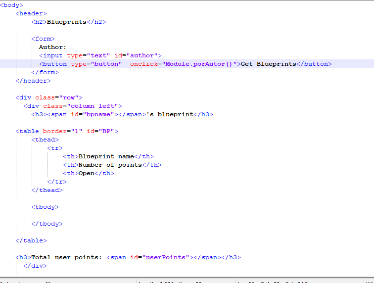

* In the <head> element of the page, add the references to the jQuery, Bootstrap libraries and the Bootstrap style sheet.

     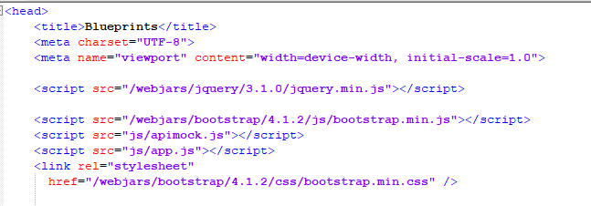
      
* Upload the application (mvn spring-boot: run), and rectify:
  * That the page is accessible from: http://localhost:8080/index.html .
  
	Vista de la pagina sin funcionalidades por ahora.
	
	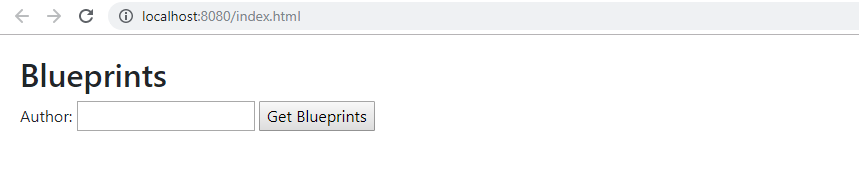
  
  * When you open the browser developer console, you should NOT receive 404 error messages (that is, the JavaScript libraries were loaded correctly).
## Frontend Logic
* Now, you will create a JavaScript Module that, as a controller, maintains the states and offers the operations required by the view. For this, consider the JavaScript Module pattern, and create a module in the static/js/app.js path.
* Copy the provided module (apimock.js) in the same path of the module created before. In this one add more planes (with more points) to the 'burned' authors in the code.
	
	Se añaden mas planos.
	
	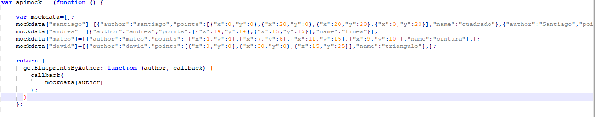
	
* Add the import of the two new modules to the HTML page (after importing the jQuery and Bootstrap libraries):
	
	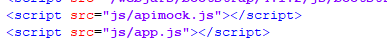

* Have the previously created module keep private:
  * The name of the selected author. 
  * The list of name and size of the plans of the selected author. That is, a list of objects, where each object will have two properties: plan name, and number of points on the plane. Together with a public operation that allows changing the name of the currently selected author.
  
  
* Add to the module app.js a public operation that allows updating the list of plans, based on the name of its author (given as a parameter). To do this, said operation must invoke the getBlueprintsByAuthor operation of the provided apimock module, sending as a callback a function that:
  * Take the list of plans, and apply a map function that converts your elements to objects with only the name and number of points.
  
	Funcion que convierte cada plano en un objeto con solo el nombre. 
  
	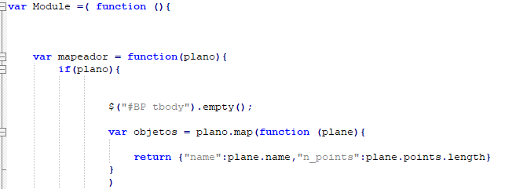
  
  * On the resulting list, make another map, which takes each of these elements, and through jQuery add a  element (with the respective ) to the table created in point 4. Consider the jQuery selectors and tutorials available online. For now do not add buttons to the generated rows.
  
	Funcion que añade los valores en la tabla HTML.
	
	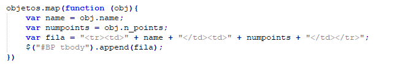
  
  * On any of the two listings (the original, or the one transformed by map), apply a reduce that calculates the number of points. With this value, use jQuery to update the corresponding field within the DOM.
  
	Funcion que suma el numero de puntos total del autor.
  
	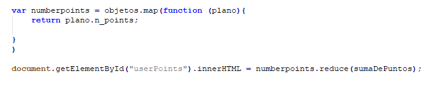
	
	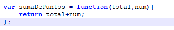
	
	Se invoca al metodo en apimock.js
	
	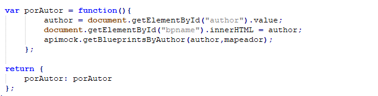
  
* Associate the previously created operation (that of app.js) with the on-click event of the page query button.

	Se añade el metodo porAutor en el evento **on-click**.

	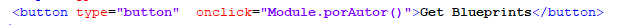

* Verify the operation of the application. Start the server, open the HTML5/JavaScript application, and rectify that when entering an existing user, the list of the same is loaded.

	Al ejecutar la aplicacion se comprueba su funcionalidad.

	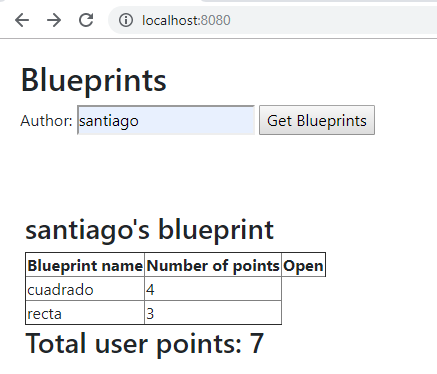
	
	
## Next Week
*	To the page, add an element of type Canvas, with its respective identifier. Make your dimensions not too large to make room for the other components, but enough to be able to draw the plans.

	Se añade un elemento de tipo canvas de 500x250

	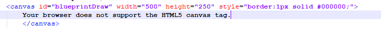

*	To the app.js module add an operation that, given the name of an author, and the name of one of its planes given as parameters, using the getBlueprintsByNameAndAuthor method of apimock.js and a callback function:

	getBlueprintsByNameAndAuthor en apimock

	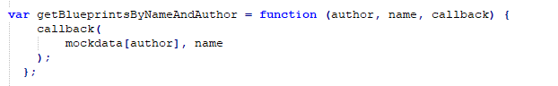

	*	Consult the points of the corresponding plane, and with them, draw straight line segments, using the available HTML5 elements (Canvas, 2DContext, etc.)Update the field with jQuery where the name of the plane being drawn is shown (if that field does not exist, group it to the DOM). 
	
		Funcion que consulta los puntos de un plano dado y lo grafica
	
		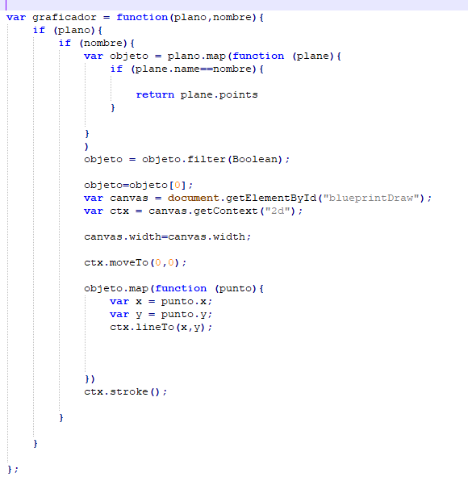
		
		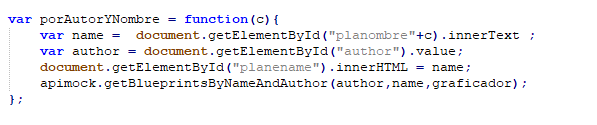
		
	
*	Verify that the application now, in addition to displaying the list of the plans of an author, allows you to select one of these and graph it. To do this, have the button generated with the click event associated with the operation done in the last column (sending the corresponding names as a parameter).

	En el momento en que se añaden datos a la tabla tambien añade un boton que permitira graficar el plano requerido
	
	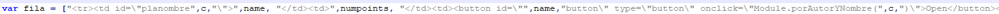

*	Verify that the application now allows: consult the plans of an author and graph the one selected.

	Al ejecutar la aplicacion se comprueba su funcionalidad.
	
	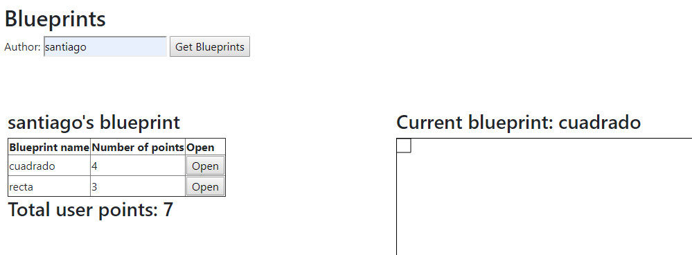

*	Once the application works (front-end only), make a module (call it apiclient) that has the same operations of the apimock, but for the same use real data consulted from the REST API. For the above, review how to make GET requests with jQuery, and how the callback scheme is handled in this context.
*	Modify the app.js code so that it is possible to switch between the apimock and the apiclient with just one line of code.
*	Review the documentation and examples of Bootstrap styles (already included in the exercise), add the necessary elements to the page to make it more colorful, and closer to the mock given at the beginning of the statement.
